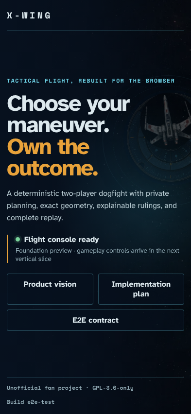
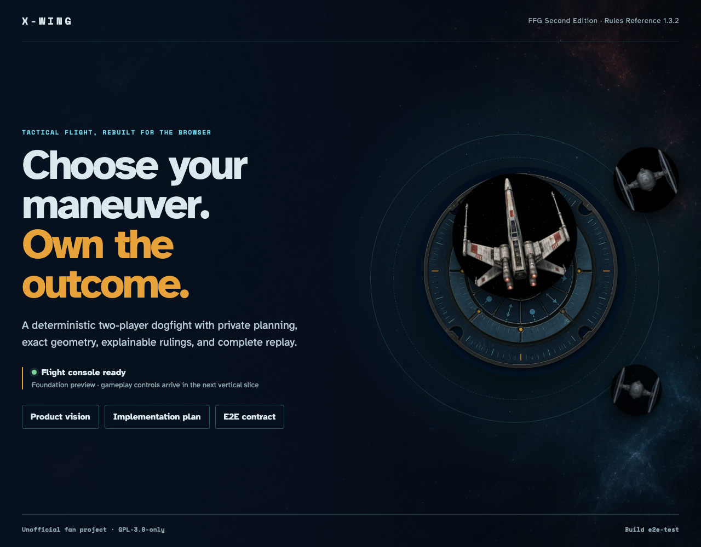
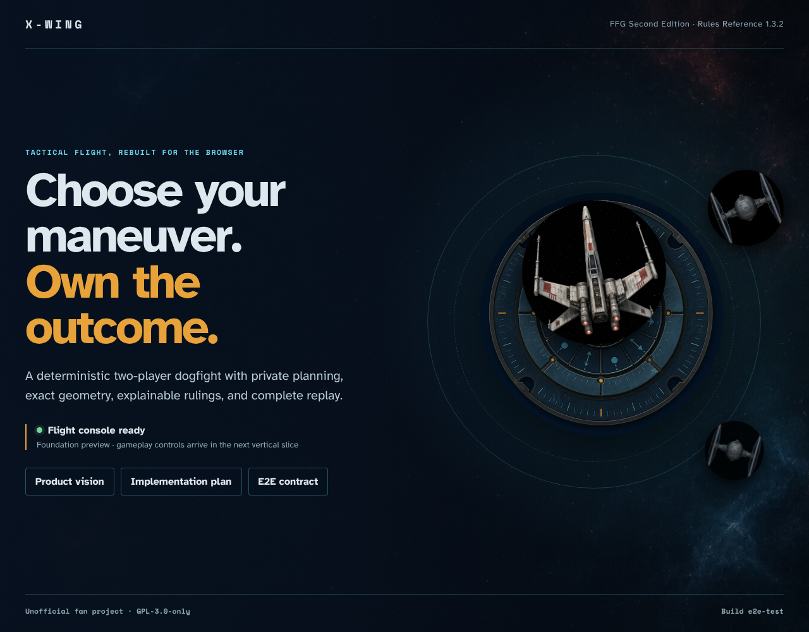

# Application shell and deployment

The static X-Wing client loads, hydrates, and serves the original dial and ship artwork at phone and desktop sizes.

## The flight console is ready

### Phone

[Open full-size macOS development baseline](./screenshots/000-flight-console-ready-phone.png)

[Open full-size Linux CI baseline](./screenshots/000-flight-console-ready-phone-linux.png)

### Desktop

[Open full-size macOS development baseline](./screenshots/000-flight-console-ready-desktop.png)

[Open full-size Linux CI baseline](./screenshots/000-flight-console-ready-desktop-linux.png)

**Verifications:**

- [x] The page exposes the stable X-Wing title and primary heading
- [x] Client hydration changes the live status to “Flight console ready”
- [x] The foundation scope, documentation links, GPL license, and deterministic build marker are visible
- [x] The circular dial, T-65, and TIE artwork load with nonzero dimensions
- [x] No browser error or failed request is present
