# Tabletop teaching duel

One shared 4K table pairs two private hands, keeps both dial values off the public surface, resolves deterministic movement and dice in public, and replays the immutable event history.

## Players place the reviewed setup directly on the shared battlefield

### Shared 4K tabletop

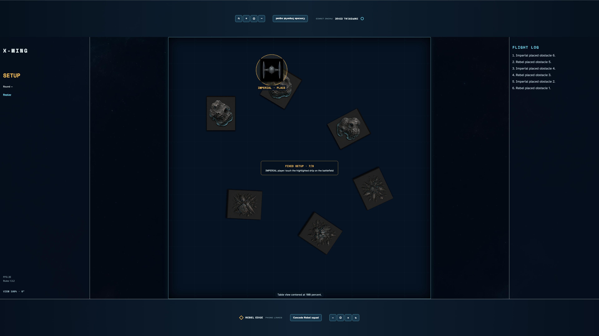

[Open full-size macOS development baseline](./screenshots/000-fixed-setup-table-4k.png)

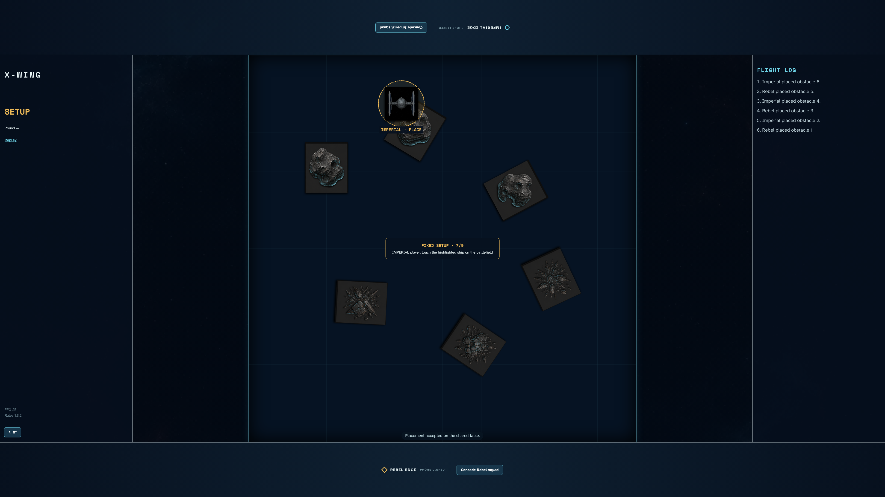

[Open full-size Linux CI baseline](./screenshots/000-fixed-setup-table-4k-linux.png)

### Rebel private hand

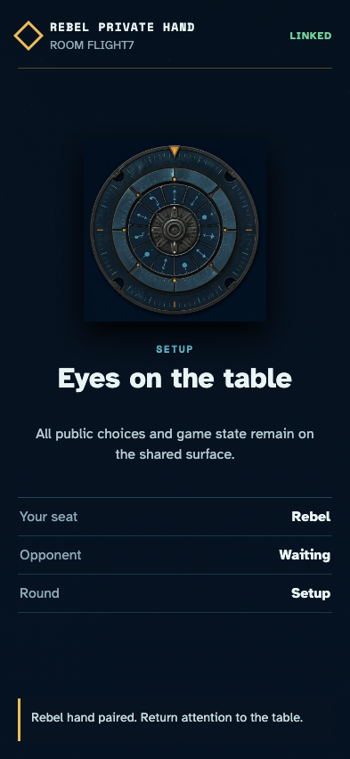

[Open full-size macOS development baseline](./screenshots/000-fixed-setup-rebel-phone.png)

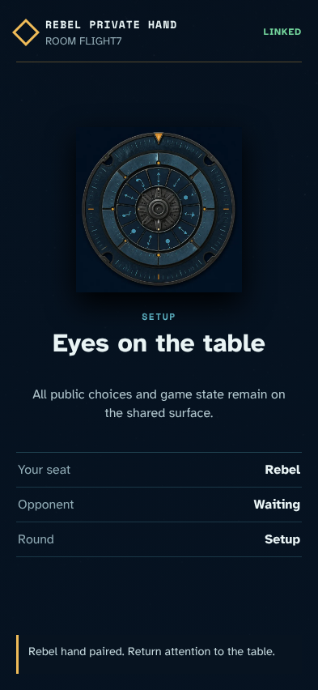

[Open full-size Linux CI baseline](./screenshots/000-fixed-setup-rebel-phone-linux.png)

### Imperial private hand

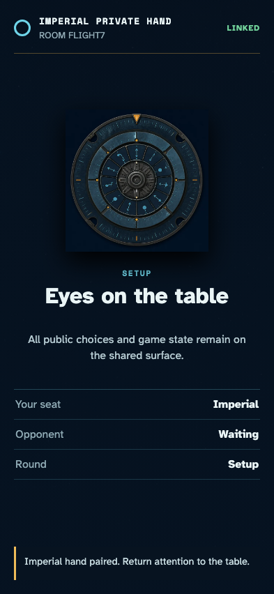

[Open full-size macOS development baseline](./screenshots/000-fixed-setup-imperial-phone.png)

[Open full-size Linux CI baseline](./screenshots/000-fixed-setup-imperial-phone-linux.png)

**Verifications:**

- [x] Six production obstacles are visibly placed at their canonical positions
- [x] The next legal ship position is a direct tabletop target for the correct seat
- [x] Seat-relative rotate, zoom, reset, and keyboard pan change presentation without changing setup geometry
- [x] Both private phones remain control-free during public setup

## Private planning is ready on the owning phones

### Shared 4K tabletop

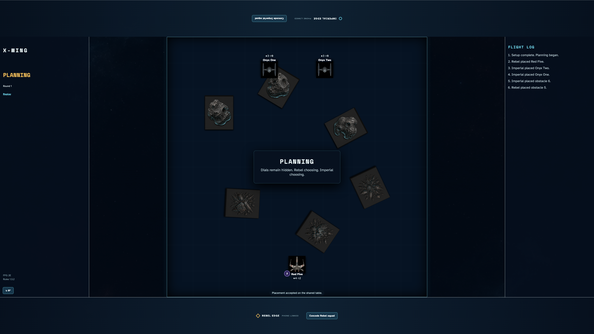

[Open full-size macOS development baseline](./screenshots/001-private-planning-ready-table-4k.png)

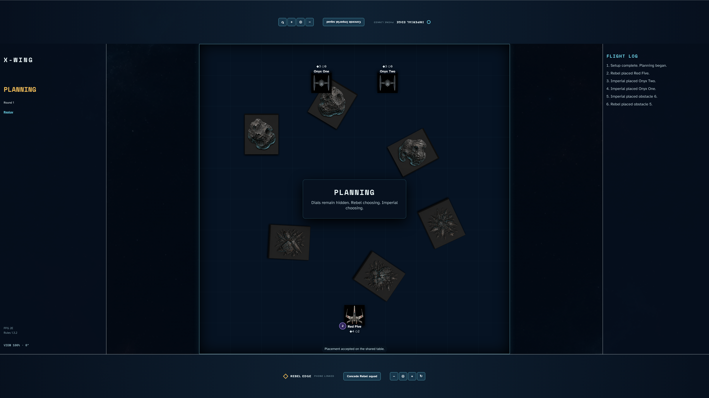

[Open full-size Linux CI baseline](./screenshots/001-private-planning-ready-table-4k-linux.png)

### Rebel private hand

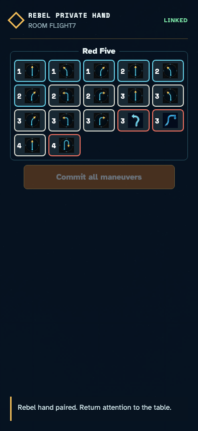

[Open full-size macOS development baseline](./screenshots/001-private-planning-ready-rebel-phone.png)

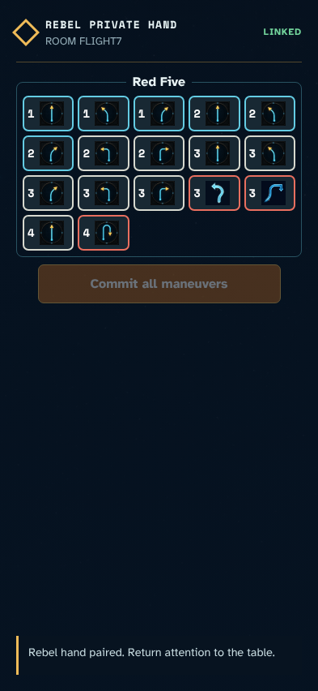

[Open full-size Linux CI baseline](./screenshots/001-private-planning-ready-rebel-phone-linux.png)

### Imperial private hand

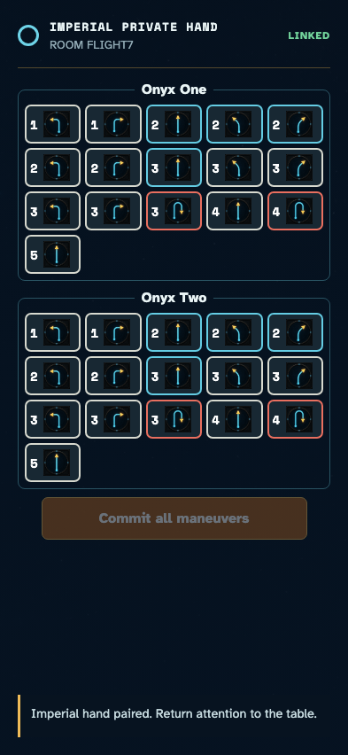

[Open full-size macOS development baseline](./screenshots/001-private-planning-ready-imperial-phone.png)

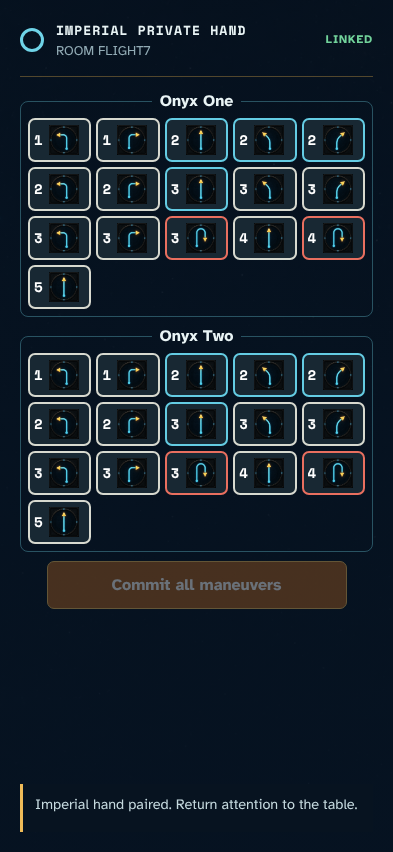

[Open full-size Linux CI baseline](./screenshots/001-private-planning-ready-imperial-phone-linux.png)

**Verifications:**

- [x] The shared table shows Planning without any dial-selection control
- [x] The Rebel hand exposes one Red Five dial and no Imperial ships
- [x] The Imperial hand exposes two own dials and no Rebel ship
- [x] All three production surfaces are error-free

## Commitment reveals only the active ship on the table

### Shared 4K tabletop

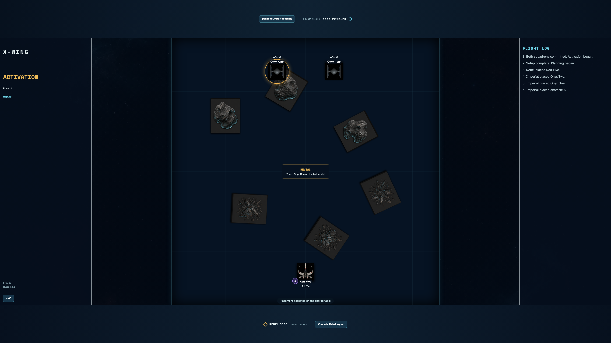

[Open full-size macOS development baseline](./screenshots/002-commitment-and-public-reveal-table-4k.png)

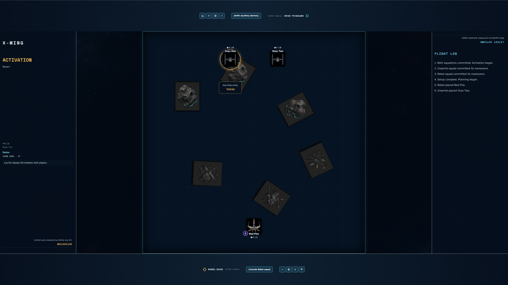

[Open full-size Linux CI baseline](./screenshots/002-commitment-and-public-reveal-table-4k-linux.png)

### Rebel private hand

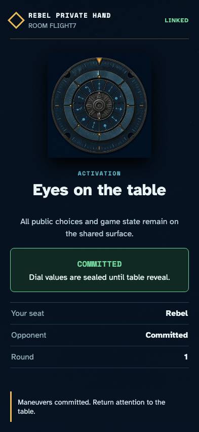

[Open full-size macOS development baseline](./screenshots/002-commitment-and-public-reveal-rebel-phone.png)

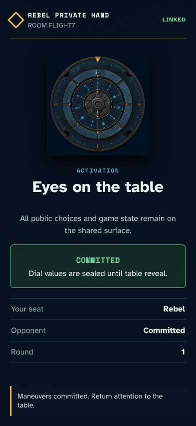

[Open full-size Linux CI baseline](./screenshots/002-commitment-and-public-reveal-rebel-phone-linux.png)

### Imperial private hand

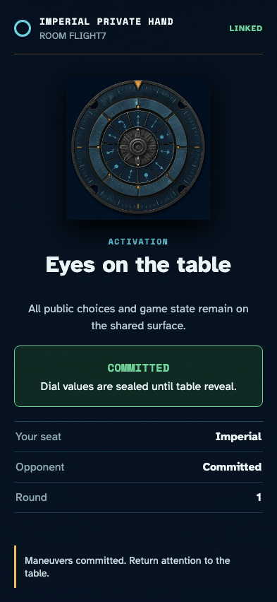

[Open full-size macOS development baseline](./screenshots/002-commitment-and-public-reveal-imperial-phone.png)

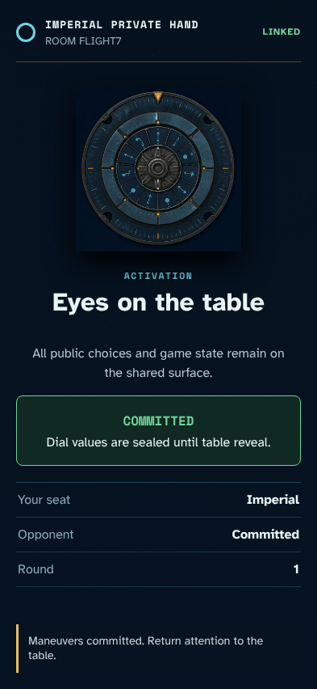

[Open full-size Linux CI baseline](./screenshots/002-commitment-and-public-reveal-imperial-phone-linux.png)

**Verifications:**

- [x] Both phones seal the dial values and contain no reveal or action controls
- [x] The table names the active ship and offers direct battlefield reveal
- [x] No hidden maneuver value is rendered on the shared table

## Movement and deterministic dice resolve on the public table

### Shared 4K tabletop

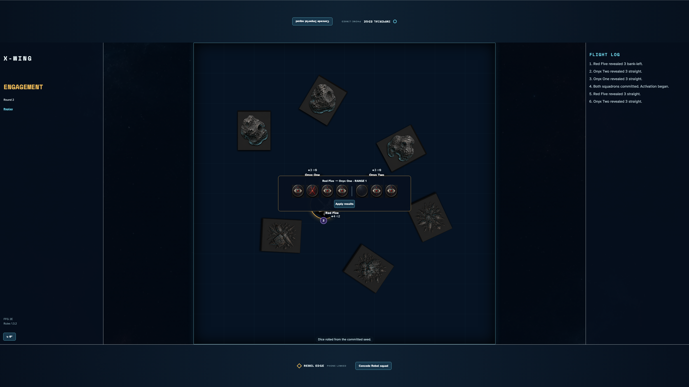

[Open full-size macOS development baseline](./screenshots/003-public-deterministic-attack-table-4k.png)

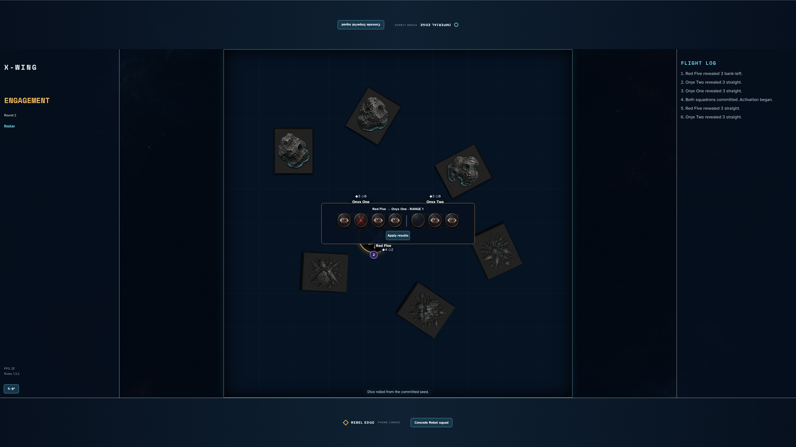

[Open full-size Linux CI baseline](./screenshots/003-public-deterministic-attack-table-4k-linux.png)

### Rebel private hand

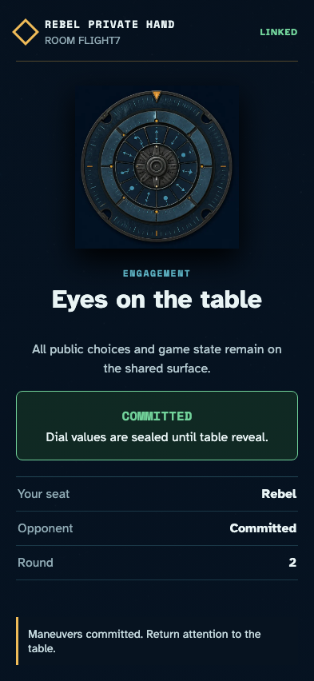

[Open full-size macOS development baseline](./screenshots/003-public-deterministic-attack-rebel-phone.png)

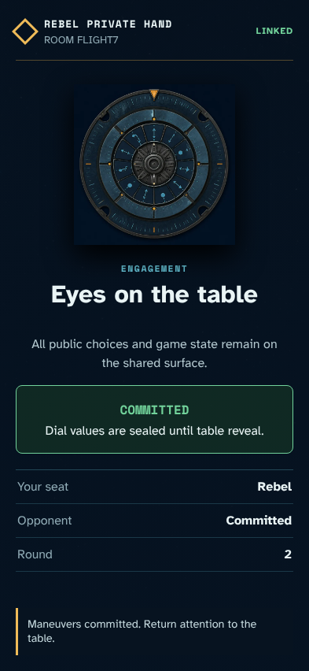

[Open full-size Linux CI baseline](./screenshots/003-public-deterministic-attack-rebel-phone-linux.png)

### Imperial private hand

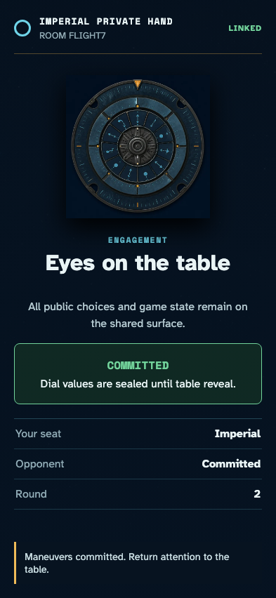

[Open full-size macOS development baseline](./screenshots/003-public-deterministic-attack-imperial-phone.png)

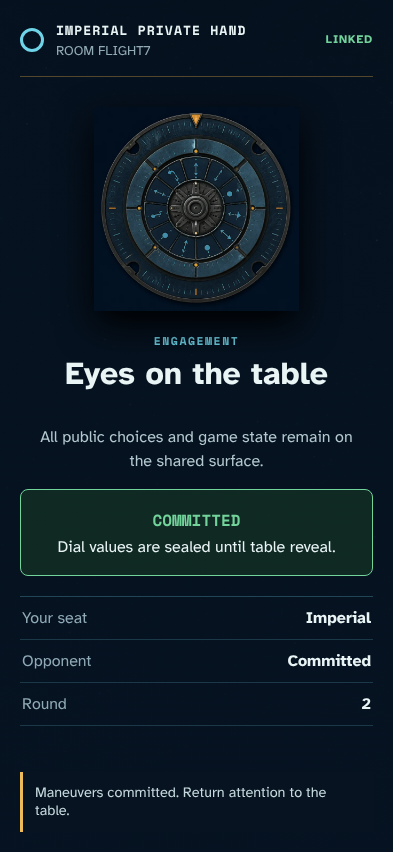

[Open full-size Linux CI baseline](./screenshots/003-public-deterministic-attack-imperial-phone-linux.png)

**Verifications:**

- [x] All three ships moved through canonical speed-three geometry before combat
- [x] The table applies the range-one bonus and presents labeled attack and defense dice
- [x] Both phones remain public-control-free waiting surfaces during combat
- [x] The complete multi-surface story has no browser or asset error

## A public two-touch concession ends the teaching duel with an unambiguous result

### Shared 4K tabletop

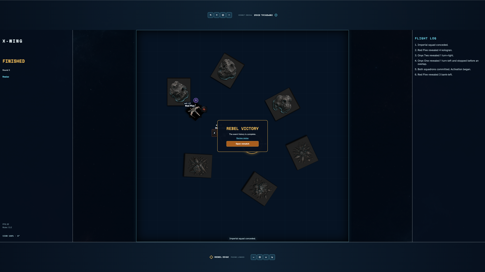

[Open full-size macOS development baseline](./screenshots/004-rebel-victory-table-4k.png)

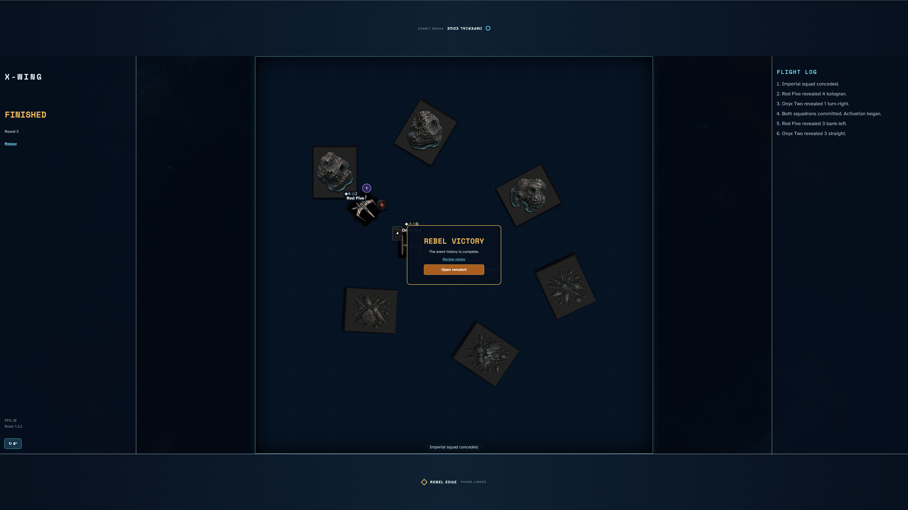

[Open full-size Linux CI baseline](./screenshots/004-rebel-victory-table-4k-linux.png)

### Rebel private hand

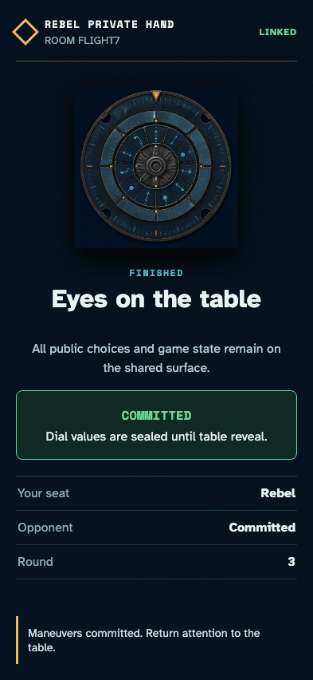

[Open full-size macOS development baseline](./screenshots/004-rebel-victory-rebel-phone.png)

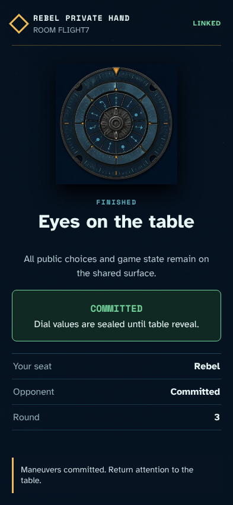

[Open full-size Linux CI baseline](./screenshots/004-rebel-victory-rebel-phone-linux.png)

### Imperial private hand

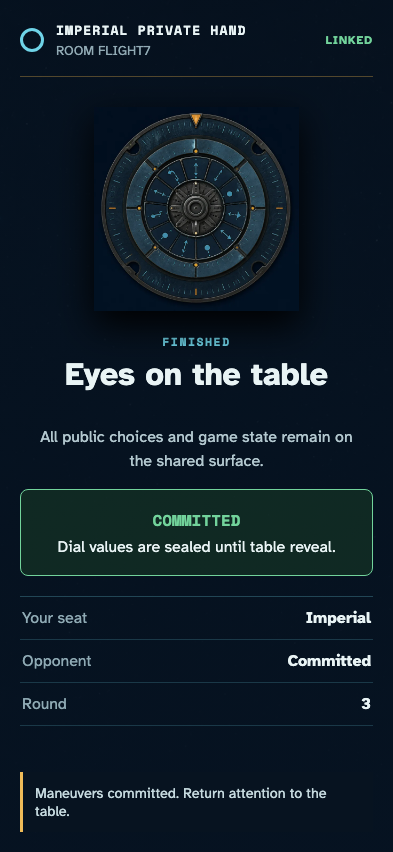

[Open full-size macOS development baseline](./screenshots/004-rebel-victory-imperial-phone.png)

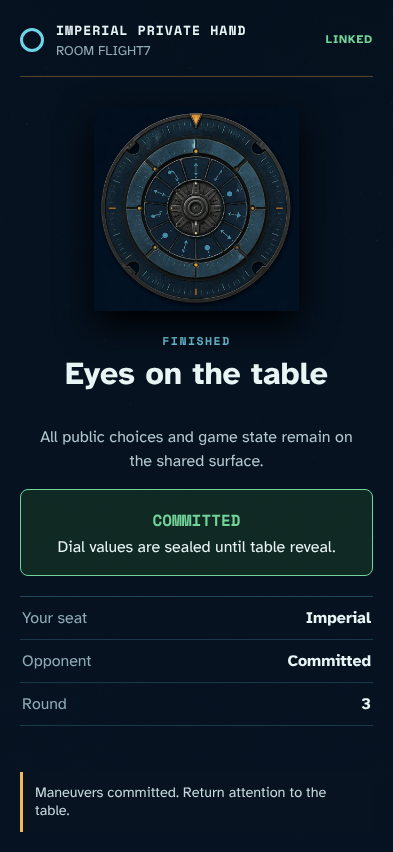

[Open full-size Linux CI baseline](./screenshots/004-rebel-victory-imperial-phone-linux.png)

**Verifications:**

- [x] A destroyed ship displays production damage-card art
- [x] The result freezes public gameplay and offers replay and rematch on the table
- [x] Both private hands remain waiting surfaces after game end

## The accepted event history can be replayed at every prefix

### Public event replay

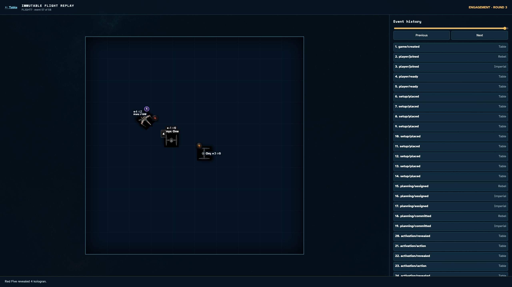

[Open full-size macOS development baseline](./screenshots/005-immutable-replay-replay.png)

[Open full-size Linux CI baseline](./screenshots/005-immutable-replay-replay-linux.png)

**Verifications:**

- [x] Replay opens at the complete immutable prefix with previous and next navigation
- [x] Stepping backward changes only the replay projection
- [x] Replay remains free of browser and asset errors
